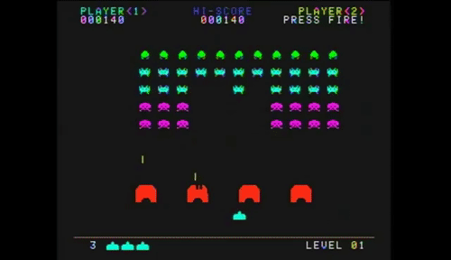
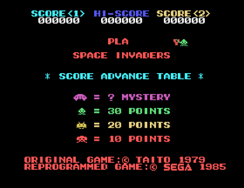
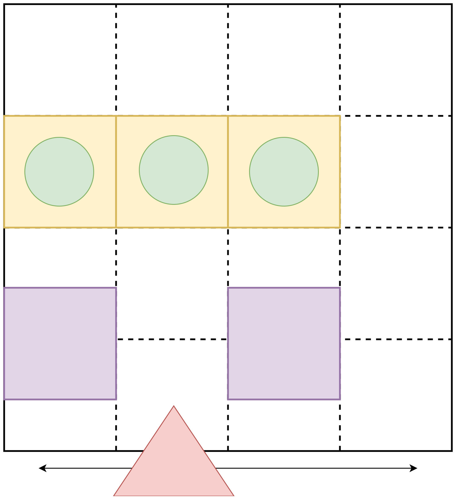
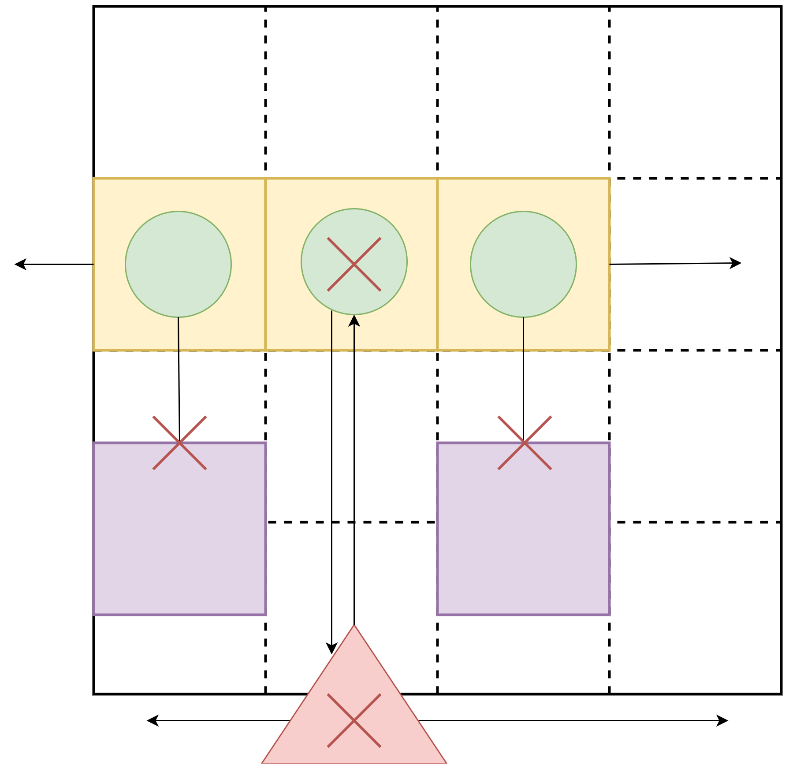

# Project: Space invaders

When an idea comes for something to build, often the idea can feel overwhelming, because it can be hard to find where to start, and the project can quickly grow into something that is far beyond your comfort zone, or worse, skill level. 

For this project, we are going to look at it holistically before jumping into the coding. How do we break the project down into versions? How do we determine what to build first? How do we organize all the code for the project in a way that makes sense? 

---

# Index

* The importance of planning beforehand 
* Space Invaders
* Breaking down the project into versions
    * Finding the fundamental elements
    * Where to start
* How can we organize the code for the project?
    * What is git
    * Feature branching and version control
* Breaking versions down to tasks
    * What are issues
    * How to determine issue order
* Getting started

# The importance of planning beforehand 

When coding a project that you could not create in one sitting, planning is vital. No matter your skill level, experience or attitude, you will need to have a plan played out in order to really accomplish your project. 

Planning allows you to see how long it is going to take you to finish a project, what skill you are going to need in order to create certain features, and an overall plan and guide. Planning helps prevent the since of overwhelming confusion and work, by giving yourself a structured guide on how to tackle the work.

The importance of planning for a project cannot be overstated. From a weekend hackathon, to a full scale team project, without a plan you are shooting yourself in the foot. 

As this course is focused on the individual, we will not discuss the assigning of issues and tasks to developers with the skills for the work, or the overall team management that is needed to distribute a project effectively amount a team. 

# Space Invaders

Before we can break the project down, lets go over what we will be building in this module... Space invaders! Well, a bit of a diluted version that has also been simplified. 

For those unfamiliar with space invaders, lets cover the basics. 

    

There are 3 entities we are going to be looking at. The "baddies" (aliens) who move as a group, depending and shooting. Then we have our shooter, who moves side to side, and can shoot up. Lastly we have "blocks" that stop the aliens from shooting our shooter, and give the shooter somewhere to hide from alien shots. We are going to entirely ignore the mothership ominously pacing above the aliens.

    

Then we have the metrics we need to keep track of, such as the users score, the high scores(which need to be saved between games), and the various points each alien type is worth. 

As we can see, even in this simple game there is so much to keep track of! It can feel overwhelming when even thinking about it, never mind trying to build it. In the below section we are going to learn how to break down the game into more digestible sections that we can easily accomplish. 

# Breaking down the project into versions

Now that we understand what we are going to try build, lets figure out how to break it down so we can build it.

## Finding the fundamental elements

The most core component's of the game are the fundamental elements. This is the absolute minimum we need in order to play the game. We need to strip out all the elements that are not fundamental. How do we do this? Well lets go through the game and figure it out.

**Side note:** The version of your project where only the absolutely core features are working is called a Proof Of Concept (POC). A POC is the absolute core value add of the project. 

### How do we determine what the most core value is of our project?

The answer to this question is partially depended on what kind of app you are trying to make. If you want to make a game (like we do) than your core value is the mechanism in which a player will interact with your app. In our case, their ability to move side to side, hide and shoot at aliens. That is the very core of the space invaders game (while there could be debate around this, its not a democracy here).

In non-game apps the core feature would be what ever your app's core value is. Making an app that tracks your gym work outs? The core component is data entry and visualization. This does not mean the core components need to be "pretty", its in fact the opposite. In a POC your app in no way needs to be aesthetically pleasing, rather it needs to be the absolute minimum needed to prove that people will enjoy your game, or need/want to use your app.

To summaries:

The core component of an app is the most fundamental value add your app is trying to bring. 

The core component of a game is the most basic way in which the user must interact with the game.

## Where to start

Now that we understand what a core component is, let's figure out what our games most core components are. 

    

The yellow boxes represent the group of aliens. The green circle represent each individual alien. The purple boxes are the blockers, and the red triangle is our user. The user is only able to move side to side in this very basic elements breakdown. 

Below, we will look at the basic interactions. What happens between the player and the game that makes the game fun to play? Well shooting of course!

    

We can see that the purple blocks cancel any shots they receive (for our very basic iteration these blocking blocks will not have a health). The green aliens and our red player can shoot each other in the gaps of the blocks. Our alien group (they yellow squares) can move side to side as a unit. 

If the player is shot, they die and respawn. If an alien is shot, it does and does not respawn. We can worry about the points later, as they are not fundamental to this version.

This is all the basic components of our game. But how do we even start to build this? 

# How can we organize the code for the project?

While this breakdown may have simplified the game significantly, there is still a lot of work to be done before we have a working game. So what do we need to do first? How do we know where to start?

First things first, we need to be able to see what we are doing. So we need to build the grid that all our user interactions will take place on. While the original game has a large grid, we don't need to worry about this, as the size of the grid is not a core value, so we can make the grid any reasonable size. 

Then we need to have our player on the board. The player also needs to be able to control what column of the grid they are in. 

Finally for our bases, we need to have the aliens on the board, as a grid in and of themselves. 

## What is git

Git is a version software manager. 

## Feature branching and version control

Feature branching means to make a git branch of each of the core features we want our game to have. While this may feel like overkill for this game, it is vital that a good habit of committing and a solid foundational understanding of a git work environment is developed. 

# Breaking versions down to tasks

We can see from our section on where to start what the basic versions of the game will entail, but how do we break those versions down into accomplishable tasks?

## What are issues

## How to determine issue order
# Getting started