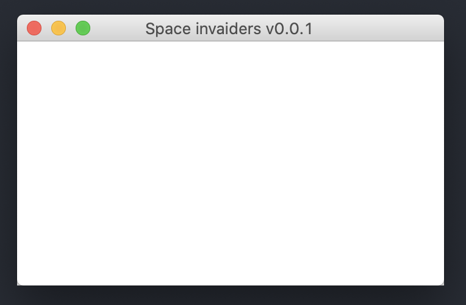
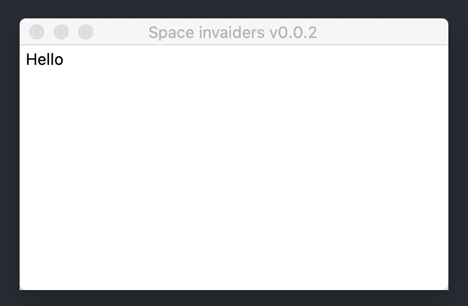
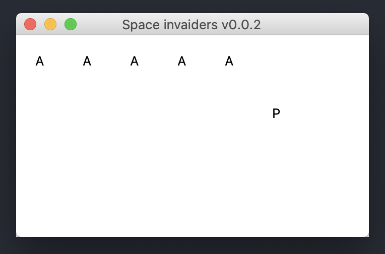
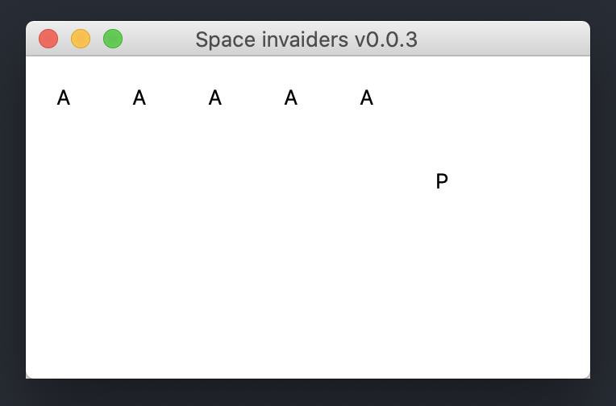

# V 1.0.0

For this iteration we are going to:
* Set up a python GUI builder
* Make the basic grid for our game
* Get comfortable with libraries and imports 

# Lets get started!

To learn all the basics of the tkinter library we are using, check out this guide [here](https://dzone.com/articles/python-gui-examples-tkinter-tutorial-like-geeks).

Once you have got a feel for the basics, let's get started on our game of space invaders!

# V 0.0.1

In this iteration we are going to get our basic window set up

## Everything you need to know to get started

First, we need to import the GUI builder we are going to use:
```
from tkinter import *
```

The `tkinter` library is a part of the basic python packages, so we don't need to do anything special to get the package into our project. 

Next we need to know how make the GUI window pop up:
```
# Here we  are defining our window
window = Tk()

# Here we are setting a property of our window, the lable
window.title("The lable for your window")

# Here we are calling the mainloop of the window. This will display our window
window.mainloop()
```

Now that we have the basic window displaying, lets set a minimum size for the window:
```
# Here we are setting the size of the window
window.geometry('350x200')

# Note that we need to set all the properties of the window before calling the main loop
window.mainloop()
```

Now that we have our basic window displaying, your code should look something like this:

```
from tkinter import *

window = Tk()
window.title("Space invaiders v0.0.1")
window.geometry('350x200')

# Here is where our game is going to happen

window.mainloop()
```

When you run your app it should look like this:

<div align="center">
    
</div>

# V 0.0.2

In this version we are going to get the basic layout for our game set up. This will include our grid of aliens, and our player.

Lets start by adding a label to our window. A label is defined like so:

```
# This is creating the label
lbl = Label(window, text="Hello")

# Here we are setting the labels position on the grid
lbl.grid(column=0, row=0)
```

When you run your script it should now look like this:

<div align="center">
    
</div>

Now we need to add a whole bunch more labels for all our aliens and one for our player.

For now, we can just have 5 aliens, and of course, our player
```
alien1 = Label(window, text="A")
alien1.grid(column=0, row=0)

alien2 = Label(window, text="A")
alien2.grid(column=1, row=0)

alien3 = Label(window, text="A")
alien3.grid(column=2, row=0)

alien4 = Label(window, text="A")
alien4.grid(column=3, row=0)

alien5 = Label(window, text="A")
alien5.grid(column=4, row=0)

player = Label(window, text="P")
player.grid(column=5, row=1)
```

Don't worry for now that our game looks very ugly - later we will replace these text labels with some images. 

Lets add some padding to our label so that they look a bit better. You add padding like so:

```
alien4 = Label(window, text="A", padx=15, pady=15)
```

Your game should now look like so:

<div align="center">
    
</div>

# V 0.0.3

Now that we have the basic labels in place, we need to make our aliens move. 

First things first, rename your currently `.py` file and call it `window.py`.
Now, make a second file (in the same directory as your `window.py` file) and call it `aliens.py`. This is where all the logic for our aliens is going to sit. 

Now, inside your `aliens.py` file, lets make a function called `alienSetup():`. Now lets copy paste all our alien labels into this function. 

You should see that there is red underline under the labels. This is because we have not imported the `tkinter` library into this file. So add the import to the top of your file 
```
from tkinter import *
```

Next you are going to see that the window is underlined in red. This is because we have not defined a window in this file. We want to use the same window from our `window.py` file, so how can we pass that window into our new `aleins` file?

We need to add the window as a parameter for our function. This way we can pass our window from the `window.py` file into our `alienSetup()` function. 

Your aliens file should now look something like this:
```
from tkinter import *

def alienSetup(window):
    alien1 = Label(window, text="A", padx=15, pady=15)
    alien1.grid(column=0, row=0)

    alien2 = Label(window, text="A", padx=15, pady=15)
    alien2.grid(column=1, row=0)

    alien3 = Label(window, text="A", padx=15, pady=15)
    alien3.grid(column=2, row=0)

    alien4 = Label(window, text="A", padx=15, pady=15)
    alien4.grid(column=3, row=0)

    alien5 = Label(window, text="A", padx=15, pady=15)
    alien5.grid(column=4, row=0)
```

We are half way there! Now what we need to do is import our `aliens.py` file into our window file, so that we can call our `alienSetup` function. To import another file we add the following to the top of our file:
```
# Here we have our import for tkinter
from tkinter import *

# This will import our aliens file, and extract our alienSetup function
from aliens import alienSetup
```

The final step for this version is calling our function inside our `windows.py` and passing the `window` object into our `alienSetup()` function. It should look something like this:
```
from tkinter import *
from aliens import alienSetup

window = Tk()
window.title("Space invaiders v0.0.3")
window.geometry('350x200')

# Here we call our alienSetup function, and pass the window object
alienSetup(window)

player = Label(window, text="P", padx=15, pady=15)
player.grid(column=5, row=1)

window.mainloop()
```

When the window is run, it should look identical to how it did last time:

<div align="center">
    
</div>

# v0.0.4

Our aliens are now in their own file, so now we can add some moment to them!


Now lets add some buttons!

```
# This defines your button
btn = Button(window, text= "Click Me")

# This puts your button on the grid 
btn.grid(column=0, row=1)
```